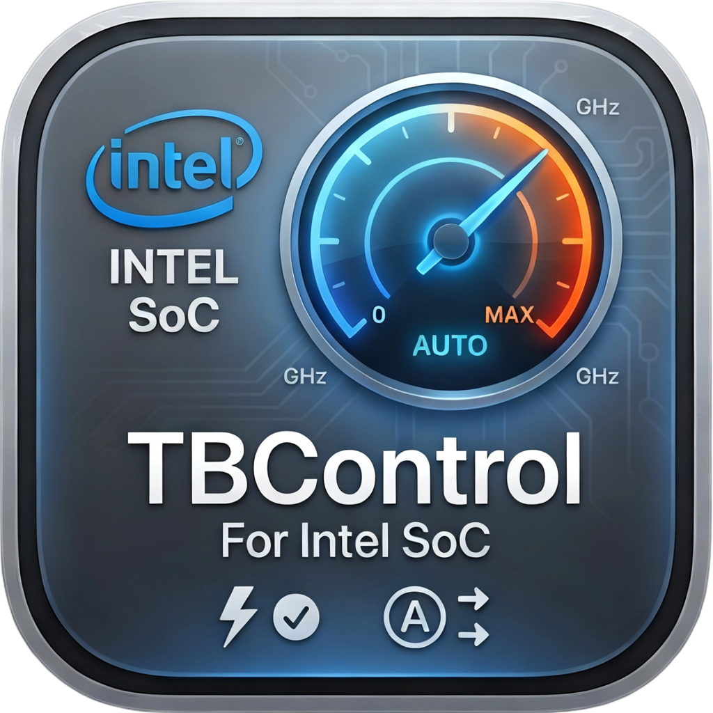
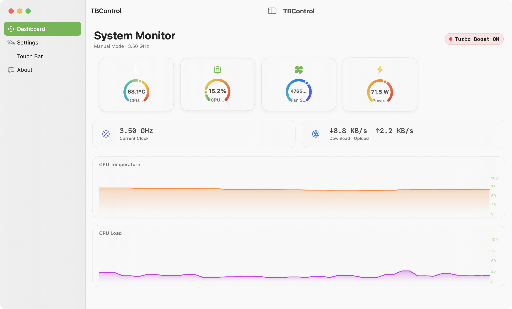
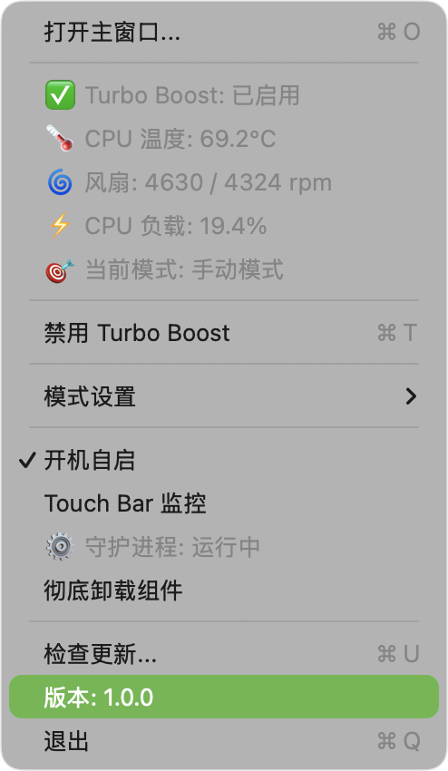

# TBControl — macOS Turbo Boost 控制工具

<p align="center">
  
</p>

<p align="center">
  
  <br/>
  <em>主界面 — 侧边栏导航 + Gauge 仪表盘 + 实时曲线图</em>
</p>

<p align="center">
  
  <br/>
  <em>设置页 — 分组表单 + 模式选择</em>
</p>

<p align="center">
  
  <br/>
  <em>Touch Bar 实时监控</em>
</p>

> **🌐 [English README →](README_EN.md)**

轻量级 Intel Mac 睿频（Turbo Boost）控制工具，通过内核扩展实现对 CPU 睿频状态的底层控制，支持多种智能自动化模式。

---

## 功能特点

- **手动控制** — 一键启用/禁用 Turbo Boost
- **多种自动模式**：
  - **温度** — CPU 温度 > 75°C 自动关闭，< 65°C 恢复（10°C 迟滞）
  - **负载** — CPU 占用 ≥ 75% 持续 10 秒自动关闭
  - **电池** — 使用电池且电量 ≤ 30% 自动关闭
  - **风扇** — 风扇转速 > 5500 RPM 自动关闭，< 4000 RPM 持续 10 秒恢复
- **实时监控看板**：
  - **菜单栏** — 实时显示 CPU 温度、风扇转速、负载及运行模式
  - **Touch Bar 监控** — MacBook Pro Touch Bar 上显示频率、温度、风扇、电量、网络等
- **智能化体验**：
  - 状态切换时发送原生系统通知
  - 开机自启支持
  - 状态跨进程重启持久化
- **生产级优化**：
  - 一键卸载（清理 Kext、守护进程及配置）
  - 自动检测 GitHub 最新 Release
  - 集成 `os_log` 系统日志

## 兼容性

| 项目 | 说明 |
|------|------|
| **处理器** | 仅 Intel 架构（MacBook Pro/Air/iMac 等） |
| **Touch Bar** | 支持带 Touch Bar 的 MacBook Pro |
| **系统** | macOS 11.0 (Big Sur) 及以上 |
| **⚠️ Apple Silicon** | **不支持** M 系列芯片 |

## 安装指南

### 1. 前置准备（重要）

本工具使用了未签名的第三方内核扩展（Kext），您需要：

1. **关闭 SIP**：进入恢复模式 → 终端 → `csrutil disable`
2. **允许内核扩展**：macOS 11+ → 系统设置 → 隐私与安全性 → 手动允许加载

### 2. 编译构建

```bash
# 克隆仓库
git clone https://github.com/BestWaveRock/TBControl.git
cd TBControl

# 使用构建脚本生成 App 和 DMG
./Scripts/build.sh
```

构建完成后，在 `build/` 目录下可找到 `TBControl.app` 和 `TBControl.dmg`。

### 3. 安装步骤

1. 将 `TBControl.app` 拖入 `Applications` 文件夹
2. 首次运行可能需要输入管理员密码以安装守护进程（`tbcontrold`）
3. 如菜单栏图标显示 `⚠️`，请检查系统设置是否已允许 Kext 加载

## 运行模式详解

| 模式 | 逻辑说明 |
|------|----------|
| **手动模式** | 完全由用户手动切换，所有自动逻辑挂起 |
| **自动(温度)** | 温度 > 75°C 禁用，< 65°C 恢复（10°C 迟滞） |
| **自动(负载)** | CPU 占用率连续 10 秒 ≥ 75% 时禁用 |
| **自动(电池)** | 使用电池且电量 ≤ 30% 时禁用 |
| **自动(风扇)** | 风扇 > 5500 RPM 禁用；< 4000 RPM 达 10 秒恢复 |

## 技术原理

- **Kext**：通过 `MSR_IA32_MISC_ENABLE` 寄存器第 38 位控制睿频开关
- **SMC**：通过 IOKit 接口直接与 System Management Controller 通信获取硬件指标
- **Daemon**：后台守护进程 `tbcontrold` 负责逻辑判定，App 仅作为 UI 展示

## 许可证

MIT License — 详见 [LICENSE](LICENSE)

## 免责声明

本工具涉及内核级别的寄存器操作。虽然通常是安全的，但作者不对因使用本工具导致的任何硬件损坏或数据丢失负责。

---

> **🌐 [English README →](README_EN.md)**
